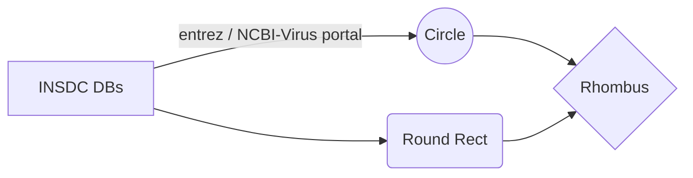

## Frequently Asked Questions

### What are viroids?

Viroids are a unique group of semi-mobile genetic agents, characterized by small genome sizes (less than 2000 nt), highly structured circular genomes, use of self-cleaving ribozymes or co-opted host enzymes, and replication via the rolling circle mechanism.

### What are viroid-like RNA agents?

We use the term “viroid-like RNA agent” to refer to the broad class of bona fide viroids, viroid-like RNAs with unconfirmed independent replication, deltaviruses, and viroid-like satRNAs. These agents have highly structured, single-stranded circular RNA genomes and replicate through the rolling circle mechanism, often with the presence of ribozymes for self-cleavage. This comprehensive database contains the entirety of viroid-like RNA agents: viroids, small circular satellite RNAs, the recently described realm of ribozyviruses (_i.e._, hepatitis delta virus and its relatives), and retrozymes.

### Why do viroids need their own database?

Despite their ever-increasing diversity and host range, a database for these agents currently does not exist. The most recent database, [the subviral RNA database](doi.org/10.1186/1471-2180-6-24), was published 15 years ago and is no longer accessible.  
To better support computational and experimental research on these agents, we have semi-automatically compiled a database of nearly ten thousand viroid-like RNA sequences from the NCBI's nucleotide database and made them available for download at viroids.org. In addition to curating the respective INSDC accessions and sequences, we have performed considerable post-processing so that ViroidDB entries are consistently formatted, enabling their direct use in common downstream analyses (e.g. circular sequences are consistently rotated and all sequence sets are deduplicated and estimated to represent complete genomes). For use cases where the complete range of variation is undesirable, we have performed clustering to identify a representative sequence for each cluster when no reference sequence is available. The database is version controlled and accessible by web via graphical user interface or command-line interface for programmatic data retrieval. Furthermore, the database is permanently archived in the Zenodo repository, ensuring future accessibility.

### Why are Viroids important?

Pathogenic members infect both plants and animals, and reports of resulting diseases have been documented since the 1930s. Presently, the only effective means of disease control is the prevention of spread, and crop infection may cause up to a 40% reduction of yield.  
If that doesn't convince you, let us ask **you** a question: Do you like McDonalds' french fries?

  
 Well, even if adible, one of the earliest known viroids can shatter the American dream of a nice, salty, deep fried french fry:  
   
 Healthy potato tuber (left), and spindle shaped tubers (right) that have been affected by PSTVd. © Dr. J. W. Roenhorst NPPO-NL

### How do we curate the database?

To collect the sequences for the database we followed this protocol:

For viroids and deltaviruses, we used the NCBI Virus portal to download complete sequences within the taxonomy IDs:  
| Subset | #Sequences | NCBI TaxID |
|----------------|------------|------------------------------------------------------------------------------|
| All | 9891 | ---- |
| Viroids | 9354 | |
| Avsunviroidae | 5284 | [185752](https://www.ncbi.nlm.nih.gov/Taxonomy/Browser/wwwtax.cgi?id=185752) |
| Pospiviroidae | 3980 | [185751](https://www.ncbi.nlm.nih.gov/Taxonomy/Browser/wwwtax.cgi?id=185751) |
| Unclassified | 90 | [265963](https://www.ncbi.nlm.nih.gov/Taxonomy/Browser/wwwtax.cgi?id=265963) |
| Deltavirus | 453 | [39759](https://www.ncbi.nlm.nih.gov/Taxonomy/Browser/wwwtax.cgi?id=39759) |
| Satellite RNAs | 35 | [141863](https://www.ncbi.nlm.nih.gov/Taxonomy/Browser/wwwtax.cgi?id=141863) |

For retrozymes, which are currently not taxonomically classified as monophyletic group, we downloaded all sequences within the NCBI Nucleotide database matching the search term ["retrozymes"](https://www.ncbi.nlm.nih.gov/nuccore/?term=retrozymes).  
Please note that due to the procedural de-duplication steps we perform, exact replications (identical strings) are masked from most down stream analyses (such as secondary structure prediction and ribozyme search), to avoid unnecessary use of computation resources and eventual storage space.

### Do you modify the original INSDC indexed sequences?

Short answer - no. Long answer - Yes, but when we do, we clearly note it. For example, rotated sequences, reverse complement, and RNA ( T --> U) versions of reference sequences are suffixed (in the fasta header) by the addition of [ViroidDB] at the end of the defline.  
Please see [Download](./Download) for more information about how to fetch and acquire any of the data from ViroidDB.

> **Note:** The **majority ** of the information in the database is derived from subsequent analyses we performed using the original sequences.

### I found a new viroid I would like to be on ViroidDB, what should I do?

Please contact us with additional information via the form in the [submit](./submit) page. We're allways happy to look at more circRNAs!  

### How can I contact you?

Feel free to [email](mailto:help@Viroids.org) us or file an issue on GitHub.

### How often will ViroidDB be updated?

Should new viroid-like RNAs classes be discovered, we hope to add them automatically on (at least) a yearly basis. If you believe an update is warranted, please contact us or perform the update yourself by submitting it as a pull request in the GitHub repository.  


### How do you generate the clusters and their information?

We care about reproducibilty just as much as we care about future proofing ViroidDB. In order to insure that as new and exciting circRNAs are discovered, they would be consistently incorporated into new realases, we wrote a custom, standalone pipeline to process all the sequences gathered from the refrence databases. Below is a consice overview of the general workflow, for a detailed description please refer to the ViroidDB manuscript, or visit the ViroidDB GitHub repo to see GPL3/MIT (open source) code.
Briefly,  





create mmseqs easy-linclust. All clusters (including "degenerate" clusters (singletons, comprised of a single sequence),  are processed  
mmseqs easy-linclust "$input_fasta" "$ini_name".clu tmp --min-seq-id "$min_prec_id"  -c "$min_prec_cov" --seq-id-mode 1 --cov-mode 0 --kmer-per-seq-scale 0.3  --threads "$THREADS"   --split-memory-limit "$Memory"M 

 ever, such anaylses Performing clustering on circular RNAs can be challenging if the sequences are not rotated consistently. To make these analyses easier, we have performed circular rotation and clustering at various levels of identity.

Many downstream analyses rely on multiple sequence alignments (MSA). Circular entities present a challenge as every rotation of the sequences must be considered because variation in sequencing and assembly may result in nearly identical sequences failing to align due to having different origins. For this reason, we performed _k_-mer profile-based clustering followed by rotational alignment for each cluster.


### Why do you rotate clusters?

> **Note:** For brevity, we use the term "rotation" to describe [circular array permutations](https://en.wikipedia.org/wiki/Cyclic_permutation).  

Many downstream analyses rely on multiple sequence alignments (MSA). Circular entities present a vey unique and veroften overlooked challenge, as every rotation of the sequences should and must be considered, because variations in sequencing and assembly may result in nearly identical sequences failing to align due to having different origins. For example, let's consider the following:  
```
>MT883227.1 TGGGTGAACAACCTTGTGGTTCCTGTGGGTCACCCCGCCCCACGGAATTAATAAAAGCAGAGGAGTAGAGAGTACTCACCTGTCGTCGCTCGACGAAGGCCGGTGAGCAGAAGGCTTAGCGGATCCCCTTGCGGCAAGACGCCCGGAACCGCGATAAAGAACTCGCCGCCGAGCCCGCGCCGCAGCTCCACCGCGCTGCTAGTCGAGCGGAGGCCGGTGGTCTCCCTCTCCCTGTGCAATAAAATCCAGGTGGCGAATGGTGTCCCCAGGGTAAAACACGATTGGTGTTCTCCC  
>LC596500.1 TGGGTGAACAACCTTGTGGTTCCTGTGGGTCACCCCGCCCTCAGGAATAATAAAAGCAGAGGAGTAGAGAGTACTCACCTGTCGTCGTCGACGAAGGCCGGTGAGCAGTAAGCCGGACGGTCCCCTCGCGGCCGTTCCTCTGGAGCTCTGCTCTAAGAACTTCGTCGCTGAGGCCCGCGCCGCCGCTCTTCCGCGCTGCTAGTCGAGCGGACGTTGGTGGTCTCCCTCTCCCTGTGCAATAAAATCCTAGCGGCGAGTGGTGTCCCCAGGGTAAAACACGATTGGTGTTCTCCC
>MN885659.1 GTGGTTCCTGTGGGTCACCCCGCCCCACGGGAAATAAAAGCAGAGGAGTAGAGAGTACTCACCTGTCGTCGTCGACGAAGGCCGGTGAGCAGTAAGCCGGACGGTCCCCTCGCGGCCGATCCTCTGGAGCTCTGCTCTACGATCTTCGCTGCTGAGGCCCGCGCCGCCGCTCTTCCGCGCTGCTAGTCGAGCGGACGTTGGTGGTCTCCCTCTCCCTGTGCAATAAAATCCAGGTGGCGAGTGGTGTCCCCAGGGTAAAACACGATTGGTGTTCTCCCTGGGTGAACAAC
>MN885660.1 GTGGGTCACCCCGCCCCACGGGAAATAAAAGCAGAGGAGTAGAGAGTACTCACCTGTCGTCGTCGACGAAGGCCGGTGAGCAGTAAGCCGGACGGTCCCCTCGCGGCCGATCCTCTGGAGCTCTGCTCTACGATCTTCGCTGCTGAGGCCCGCGCCGCCGCTCTTCCGCGCTGCTAGTCGAGCGGACGTTGGTGGTCTCCCTCTCCCTGTGCAATAAAATCCAGGTGGCGAGTGGTGTCCCCAGGGTAAAACACGATTGGTGTTCTCCCTGGGTG
```  

A rudimentry, 'as is' alignment would produce a poor result, often with many long open gap regions and many mistamatches:  

```
>MT883227.1	TGGGTGAACAACCTTGTGGTTCCTGTGGGTCACCCCGCCC-CACGGAATTAATAAAAGCAGAGGAGTAGAGAGTACTCACCTGTCGTCGCTCGACGAAGGCCGGTGAGCAGAAGGCTTAGCGGATCCCCTTGCGGCAAGACGCCCGGAA--CCGCGATAAAGAACTCGCCGCCGA-GCCCGCGCCGCAGCTCCACCGCGCTGCTAGTCGAGCGGAGGCCGGTGGTCTCCCTCTCCCTGTGCAATAAAATCCAGGTGGCGAATGGTGTCCCCAGGGTAAAACACGATTGGTGTTCTCCC------------
>LC596500.1	TGGGTGAACAACCTTGTGGTTCCTGTGGGTCACCCCGCCCTCAGGAAT--AATAAAAGCAGAGGAGTAGAGAGTACTCACCTGTCGTCG-TCGACGAAGGCCGGTGAGCAGTAAGCCGGACGG-TCCCCTCGCGGCCGTTCCTCTGGAGCTCTGCTCTAAGAACTTCGTCGCTGAGGCCCGCGCCGCCGCTCTTCCGCGCTGCTAGTCGAGCGGACGTTGGTGGTCTCCCTCTCCCTGTGCAATAAAATCCTAGCGGCGAGTGGTGTCCCCAGGGTAAAACACGATTGGTGTTCTCCC------------
>MN885659.1	---------------GTGGTTCCTGTGGGTCACCCCGCCC-CACGGGA--AATAAAAGCAGAGGAGTAGAGAGTACTCACCTGTCGTCG-TCGACGAAGGCCGGTGAGCAGTAAGCCGGACGG-TCCCCTCGCGGCCGATCCTCTGGAGCTCTGCTCTACGATCTTCGCTGCTGAGGCCCGCGCCGCCGCTCTTCCGCGCTGCTAGTCGAGCGGACGTTGGTGGTCTCCCTCTCCCTGTGCAATAAAATCCAGGTGGCGAGTGGTGTCCCCAGGGTAAAACACGATTGGTGTTCTCCCTGGGTGAACAAC
>MN885660.1	------------------------GTGGGTCACCCCGCCC-CACGGGA--AATAAAAGCAGAGGAGTAGAGAGTACTCACCTGTCGTCG-TCGACGAAGGCCGGTGAGCAGTAAGCCGGACGG-TCCCCTCGCGGCCGATCCTCTGGAGCTCTGCTCTACGATCTTCGCTGCTGAGGCCCGCGCCGCCGCTCTTCCGCGCTGCTAGTCGAGCGGACGTTGGTGGTCTCCCTCTCCCTGTGCAATAAAATCCAGGTGGCGAGTGGTGTCCCCAGGGTAAAACACGATTGGTGTTCTCCCTGGGTG------
```  

However, by merely rotating the sequences, prior to alignment, we may arrive at a considerably more sensical output:  

```
>MT883227.1 @ 202 TCGAGCGGAGGCCGGTGGTC-TCCCTCTCCCTGTGCAATAAAA-TCC-AGGTGGCGAATGGTGTCCCCAGGGTAAAACACGATTGGTGTTCTCCCTGGGTGAACAACCTTGTGGTTCCTGTGGGTCACCCCGCCC-CAC-GGA-ATTAATAAAAGCAGAGGAGTAGAGAGTACTCACCTGTCGTCGCTCGACGAAGGCCGGTGAGCAGAAGGCTTAGCGGATCCCCTTGCGGCAAGACGCCCGGA---A-----C---C-G-CGA-----T--A-----------AAGAAC-TCG-CCGCCGA-GCCCGCGCCGCAGCTCCACCGCGCTGCTAG
>LC596500.1 @ 202 TCGAGCGGACGTTGGTGGTC-TCCCTCTCCCTGTGCAATAAAA-TCCTA-GCGGCGAGTGGTGTCCCCAGGGTAAAACACGATTGGTGTTCTCCCTGGGTGAACAACCTTGTGGTTCCTGTGGGTCACCCCGCCCTCA--GGA-A-TAATAAAAGCAGAGGAGTAGAGAGTACTCACCTGTCGTCG-TCGACGAAGGCCGGT-----G-A-GC--A---G------T-------A-A-G-CCGGACGGTCCCCTC--GCGGCCGTTCCTCTGGAGCTCTG-CTCTAAGAACTTCGTC-GCTGAGGCCCGCGCCGCCGCTCTTCCGCGCTGCTAG
>MN885659.1 @ 186 TCGAGCGGACGTTGGTGGTC-TCCCTCTCCCTGTGCAATAAAA-TCC-AGGTGGCGAGTGGTGTCCCCAGGGTAAAACACGATTGGTGTTCTCCCTGGGTGAACAA-C--GTGGTTCCTGTGGGTCACCCCGCCC-CAC-GGG-A--AATAAAAGCAGAGGAGTAGAGAGTACTCACCTGTCGTCG-TCGACGAAGGCCGGT-----G-A-GC--A---G------T-------A-A-G-CCGGACGGTCCCCTC--GCGGCCGATCCTCTGGAGCTCTG-CTCTACGATCTTCG-CTGCTGAGGCCCGCGCCGCCGCTCTTCCGCGCTGCTAG
>MN885660.1 @ 177 TCGAGCGGACGTTGGTGGTC-TCCCTCTCCCTGTGCAATAAAA-TCC-AGGTGGCGAGTGGTGTCCCCAGGGTAAAACACGATTGGTGTTCTCCCT--G-G---------GT-G-----GTGGGTCACCCCGCCC-CAC-GGG-A--AATAAAAGCAGAGGAGTAGAGAGTACTCACCTGTCGTCG-TCGACGAAGGCCGGT-----G-A-GC--A---G------T-------A-A-G-CCGGACGGTCCCCTC--GCGGCCGATCCTCTGGAGCTCTG-CTCTACGATCTTCG-CTGCTGAGGCCCGCGCCGCCGCTCTTCCGCGCTGCTAG
```


### Why do some clusters lack a circular-alignment/block-chain plots?

These plots are produced by our go-to cyclic alignment tool - CSA. While we found it to give the most usful output, it is a relativly old software, whose original source code only handles clusters with several dozen members. Hence, large clusters may be limited to the other cyclic comparison tools we used if CSA failed. Very briefly, these tools do not go so far as to produce an alignment, rather they attempt to identify the optimal rotation of every sequnece in a given multifasta file, so that the distances between subsequent alignments would minimized.  
There are several other possible reasons why a rotated cluster may lack the circular/block visulation. These range from technical to more matter-of-factly:   
- The cluster has too few members. Singletons (_clusters compromised of a single sequence_) obviously have no rotational information.
- Some of the cluster members are too short.
- The shortest sequence in the cluster is **_considerably_** shorter than the largest sequence. 
- A visualtion can be rendered, but it was found to be meaningless (e.g. cluster members are identical rotations of each other).

